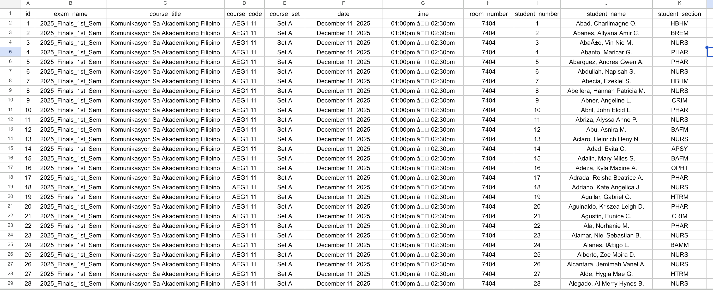

# CLI Directory

Command-line interface scripts for the Exam Room Checker.

## Scripts

- `read_pdf.py`: Parse PDF files containing student exam data and store in database or export to CSV.
- `search_db.py`: Search the database for student information.

## Usage

```bash
# Parse PDFs to CSV
python read_pdf.py read <input_dir> <output_file> --to_csv

```

## Screenshot

